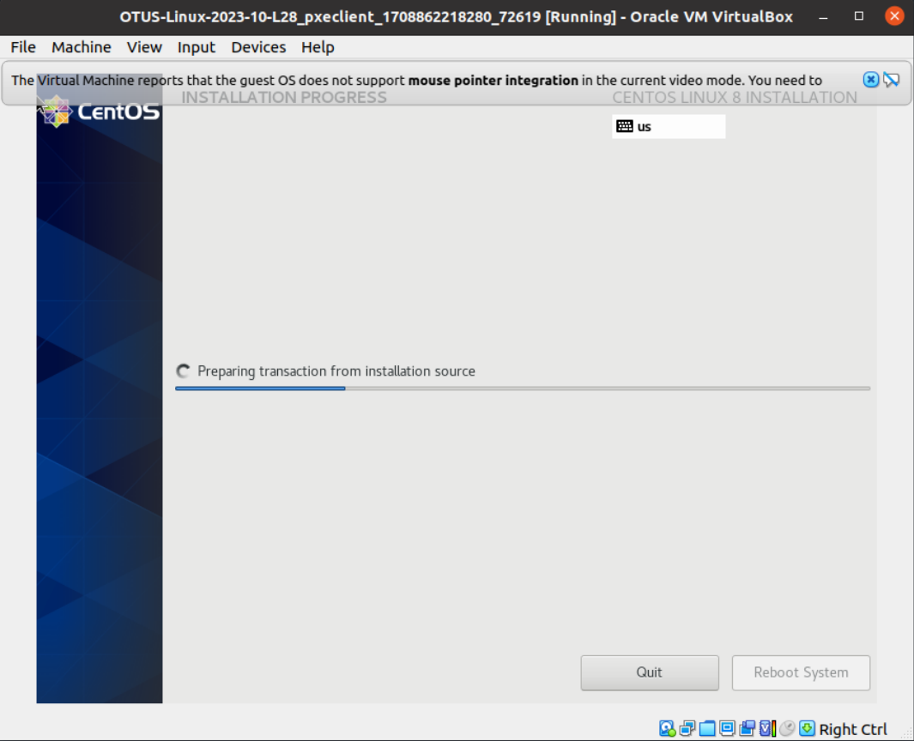

### OTUS-Linux-2023-10-L28 | PXE

В репозитории Vagrantfile в котором разворачивается сервер для загрузки дистрибутива по сети.  
В меню загрузчика есть пунк (по-умолчанию) автоматической загрузки и установки ОС по сети через HTTP.  
При запуске клиента установка начнётся автоматически.  

Ручная установка тоже работает:  

